<h1 align="center">
  Hello Padawans
  
</h1>

  

I'm at university, always researching and learning something new = )

I am currently learning about artificial intelligence, but I am also interested in cloud, web and graphic design. I'll tell you right away, I love Python, Typescript and Linux.

- 📧 Talk to me by email, remember to bring a cup of coffee...
- 🐦 Follow me there on Twitter, GitHub updates :D

___

  

  
  

  

  

  

  

